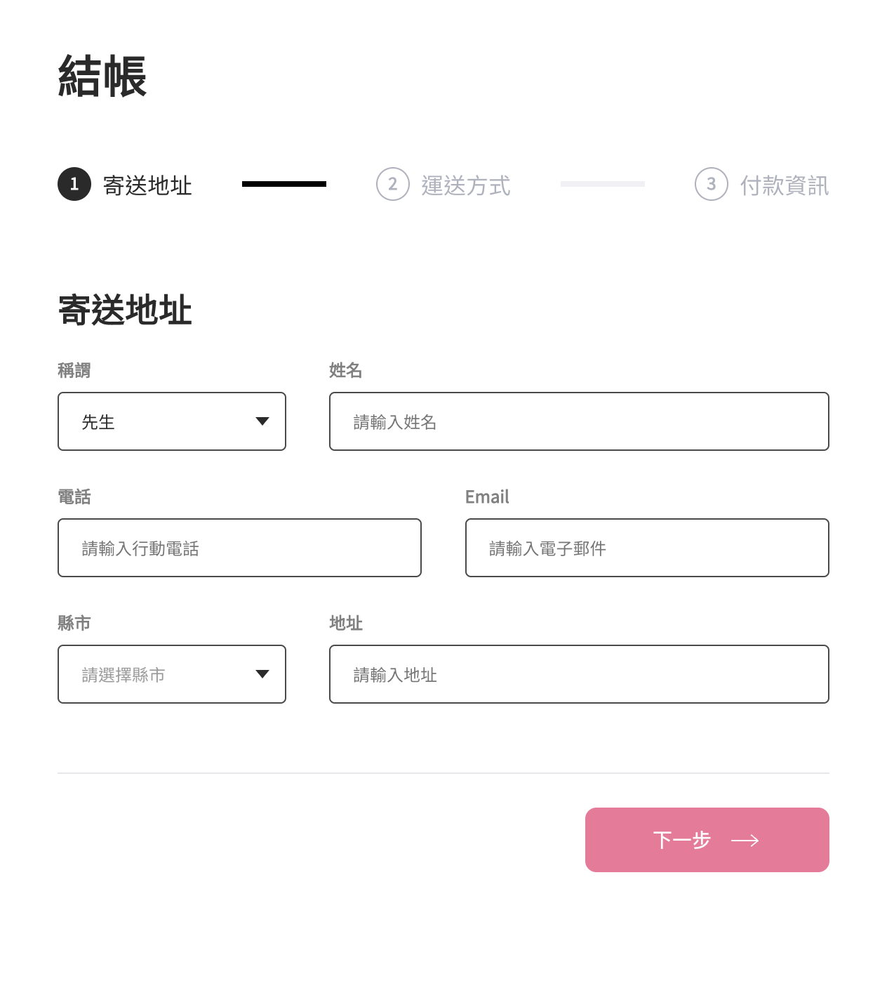

# ALPHA Shop

ALPHA CAMP Season 3 Frontend Assignment 1

---

## Project Preview

---

## This project is built by React

This project was initialized using create-react-app

---

## Project setup

1. install node.js
2. clone the project
3. open the project and type:
   `npm install`

---

## To view it in your browser

In the project directory, you can run:

### `npm start`

Runs the app in the development mode.\
Open [http://localhost:3000](http://localhost:3000)

---

## Project Directory Explanation

    /src         - root directory of source code

    /src/components   - React components
    /src/icons   - SVG files
    /src/style   - CSS style

    /public      - root directory of static files
    /public/images - pictures
